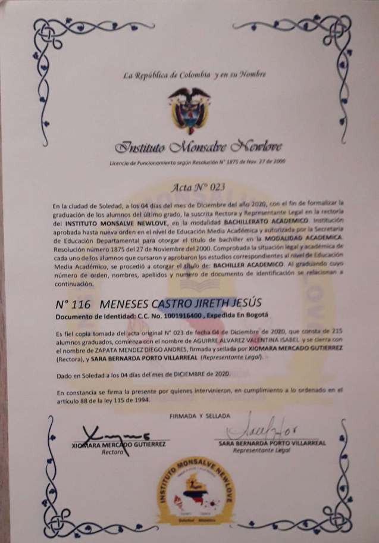

# Hoja de vida

## Datos Personales

| DATOS BASICOS |  |
| --- | --- |
| NOMBRES | JIRETH JESUS |
| APELLIDOS | MENESES CASTRO |
| FECHA DE NACIMIENTO | 08/12/2001 |
| TIPO DOCUMENTO | CEDULA DE CIUDADANIA |
| NUMERO DE DOCUMENTO | 1001916400 |
| MINICIPIO | SOLEDAD ATLANTICO |
| DIRECCION | CR15G#56A12 |
| TIPO DE SANGRE | O+ |
| CELULAR | 3216533794 |
| CORREO ALECTRONICO | JIrethmene0708@gmail.com |

## ESTUDIOS  

| ESTUDIOS |  |
| --- | --- |
| TITULO CONSEGUIDO | PRIMARIA Y SECUNDARIA |
| ESTADO ACTUAL | APRENDIZ SENA |
| LUGAR DE ESTUDIO ACTUAL | CENTRO INDUSTRIAL Y DE AVIACION |
| CONOCIMIENTOS | POGRAMACION BASICA HTML Y CSS |

## SOBRE MI

| SOBRE MI |
| - |
 TERMINE EN EL AÑO 2020 MIS ESTUDIOS ESCOLARES, ACTUALMENTE ESTOY ESTUDIANDO
 EN EL SENA (CENTRO INDUSTIAL Y DE AVIACION) COMENZANDO APENAS, LO QUE ME    
 DESTACA ES QUE SOY COMPRENSIBLE, ATENTO, CURIOSO Y AMABLE

## FAMILIA

| CENTRO FAMILIAR | |
| --- | --- |
| MADRE | ANA DELIA CASTRO RIVAS |
| HERMANA | GENESIS GORGIANIS MENESES CASTRO |

## OBJETIVOS O PLAN DE ESTUDIOS

| OBJETIVOS |
| - |
| TERMINAR LOS 2 AÑOS DEL SENA DE ANALISIS Y DESARROLLO DE SISTEMAS DE INFORMACION |
| HOMOLOGAR EN LA UNIVERSIDAD SIMON BOLIVAR PARA CONSEGUIR TITULO COMO IGN SISTEMAS Y LABORAR EN ALGUN LUGAR DEL PAIS O EN ESPAÑA |

## DIPLOMA SECUNDARIA

