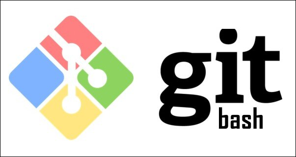
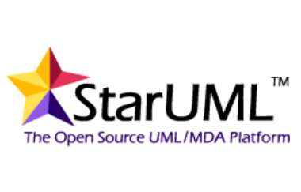

# PROGRAMAS UTILIZADOS PARA EL AVANCE DEL PROYECTO FORMATIVO

## IMAGINES PREVIAS DE LOS APLICADTIVOS UTILIZADOS

## DESCRICION DE LA UTILIDAD EN EL PROYECTO

Con estos aplicativos se dara el avance del proyecto, mediante la programcion aprendida, tales programas como Visual Code, Atom, startuml, gitbash y otras mas con las que se tendra avance, con lo aprendido, se implementara en el proyecto formativo (HOTEL) 
