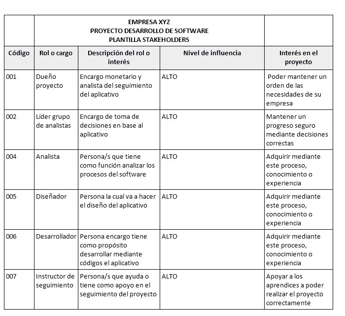
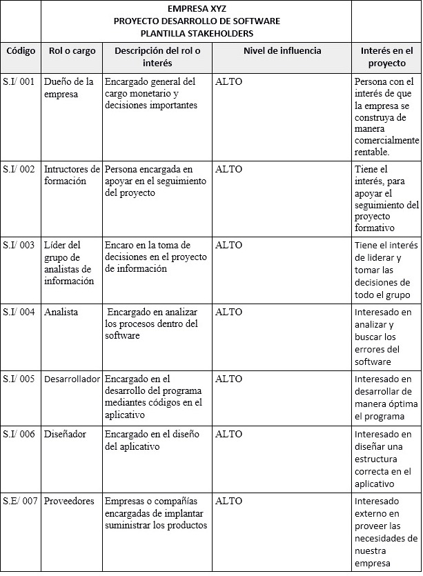

# STAKEHOLDER

## DESCRIPCION 
El stakeholder público de interés para una empresa que permite su completo funcionamiento. Con público, me refiero a todas las personas u organizaciones que se relacionan con las actividades y decisiones de una empresa como: empleados, proveedores, clientes, gobierno, entre otros.

## VISTA PREVIA

